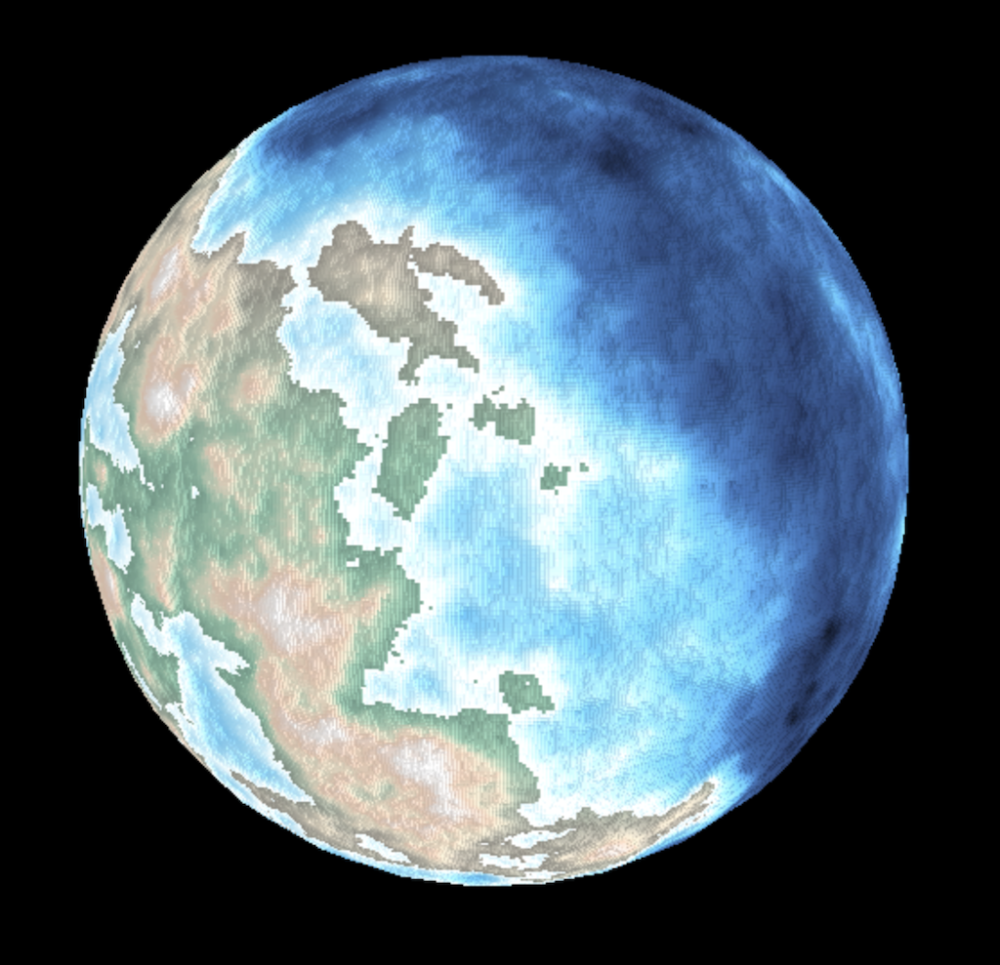
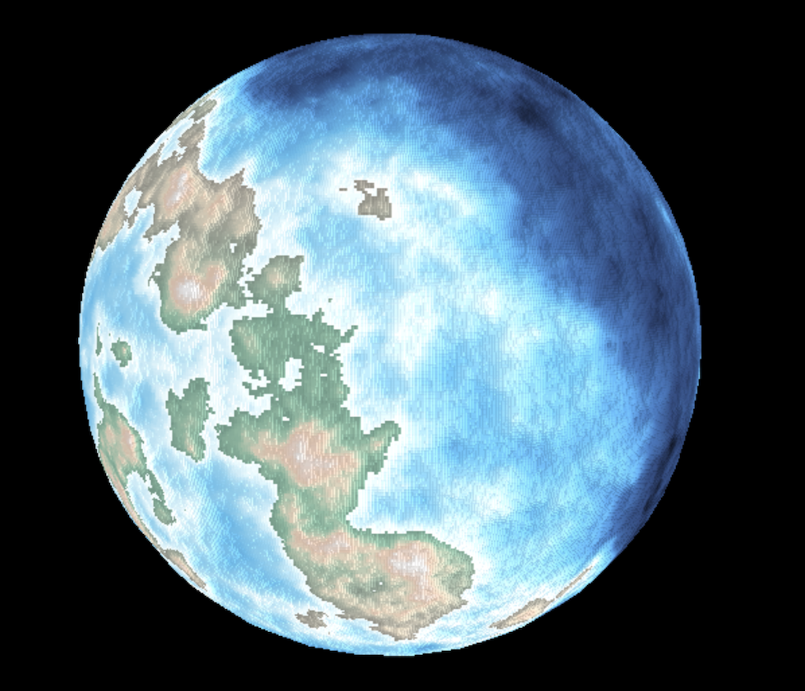
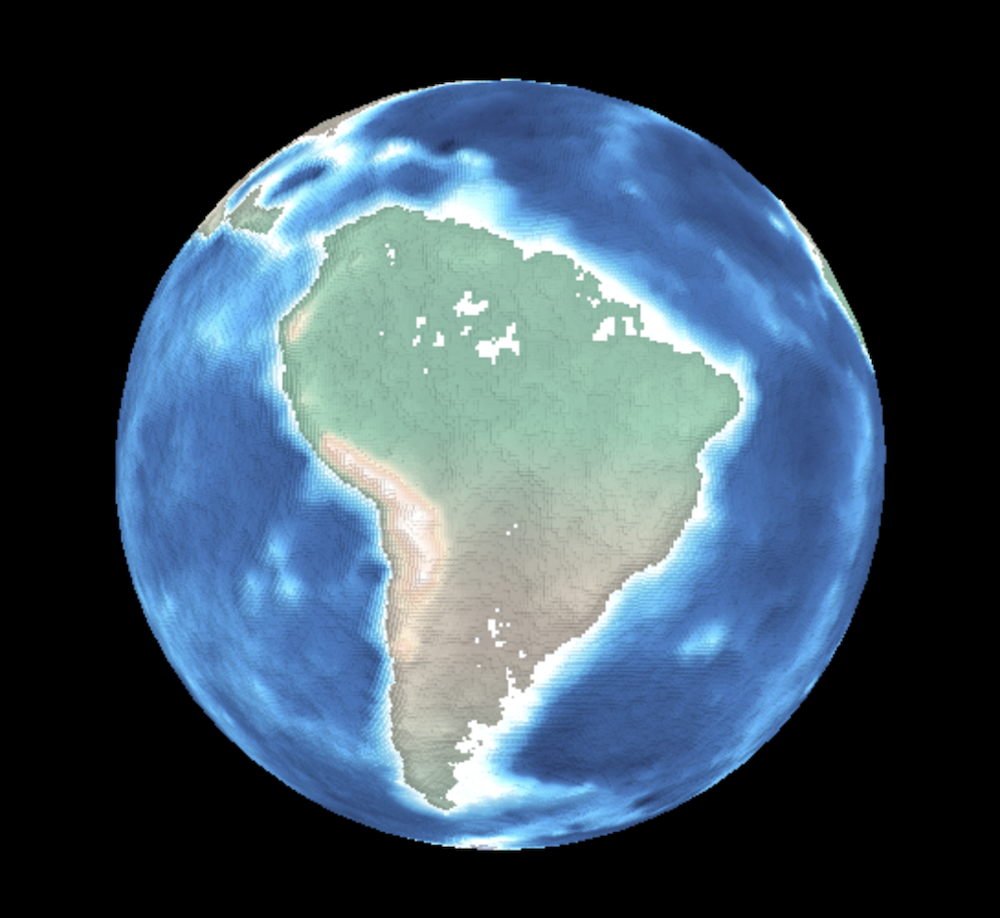

World Generator
===============

A browser based random world generator.

### Notable features:
- All operations are done in a spherical coordinate system. This is slower but means the core model is a sphere, so no projecting, and the poles "just work".
- Non-iterative approach. Precipitation and temperature are functions of elevation and latitude only. This isn't really accurate, but I wanted to see how close I could approximate it (ever wonder why none of the hottest spots are near the equator?)
- Fractal terrain inspired by mid-point displacement applied to a sphere. Theoretically unlimited detail, in practise limited by texture size/zoom strategy.

### Install:
Client side only. Clone/download and open index.html in a browser.

### Usage:
Browser GET arguments:
- `seed`: Any initial seed string or number, or "earth" for Earth-like elevation.
- `numberOfControlPoints`: Number of points to initially assign to sphere for random defaults. Default: 256.
- `detailLevel`: Number of times to sub-divide initial control points by. Higher creates more detail but performs exponential slower. Default: 4.
- `seaLevel`: Sea level expressed between 0 and 1. Higher means more land. Default: 0.7.
- `textureHeight`: threejs texture height in pixels. Higher is better, but browsers have limits. Default: 512.
- `bumpMap`: "true" to bump map texture.
- `showTemperature`: "true" to show temperature gradient instead of terrain.
- `showPrecipitation`: "true" to show precipitation gradient instead of terrain.
- `showPoints`: "true" to show control points.

### Examples:
`?detailLevel=5&seaLevel=0.65&&bumpMap=true&seed=not earth`

`?detailLevel=5&seaLevel=0.7&&bumpMap=true&seed=not earth`

`??detailLevel=4&bumpMap=true&seed=earth`

